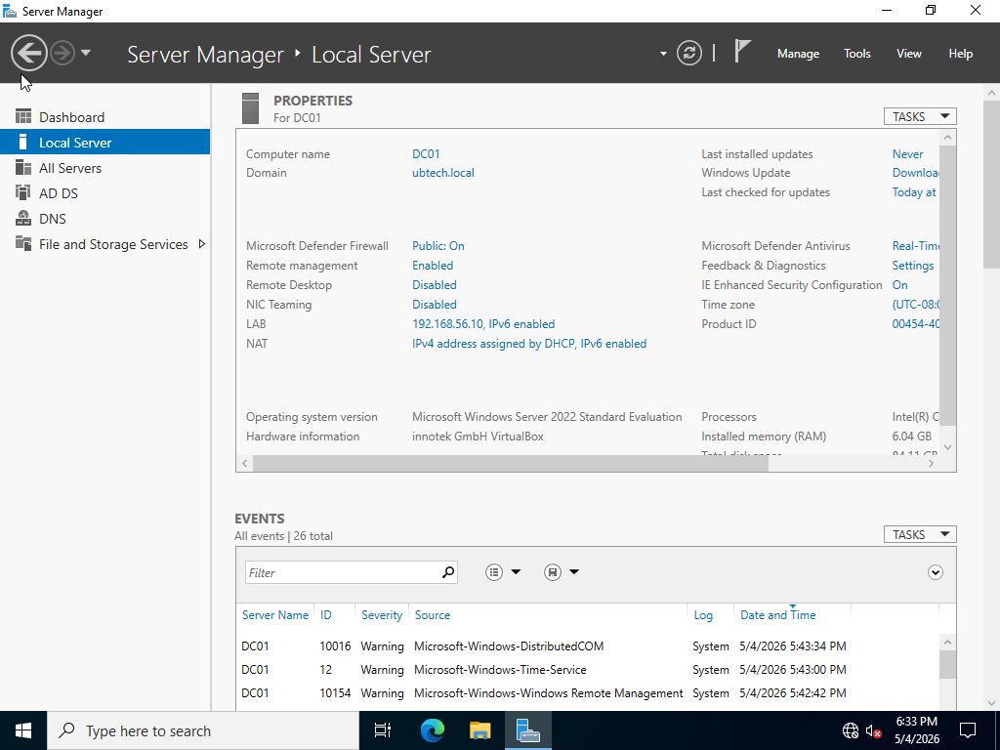
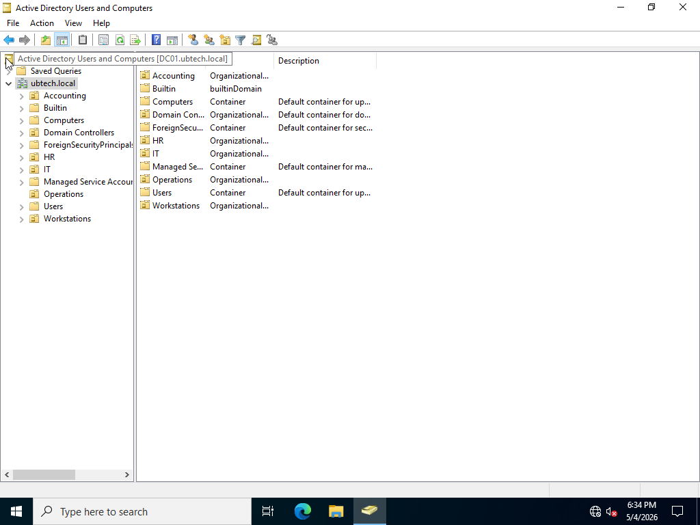
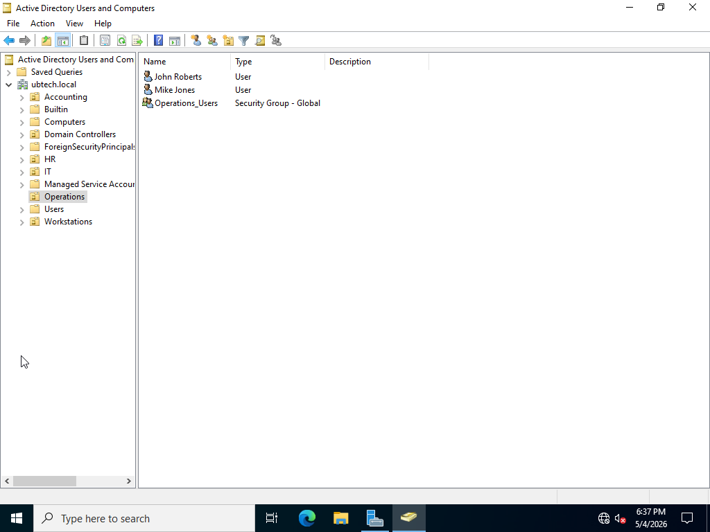
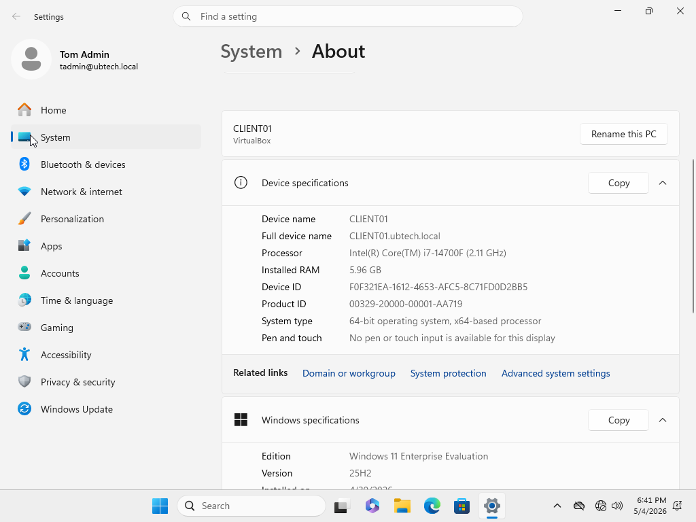
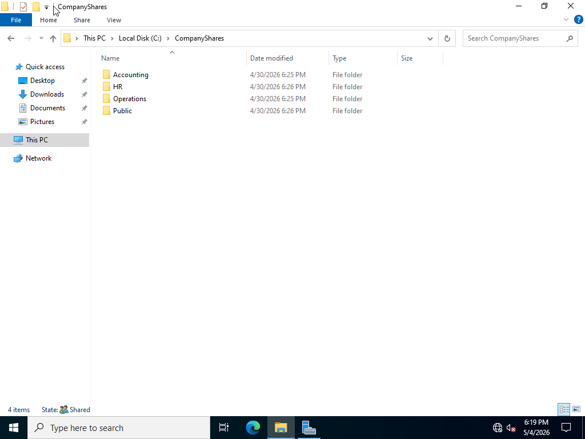
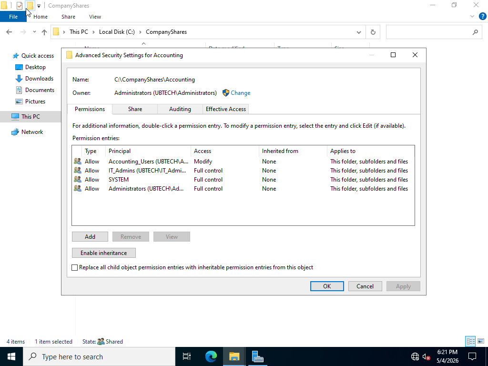
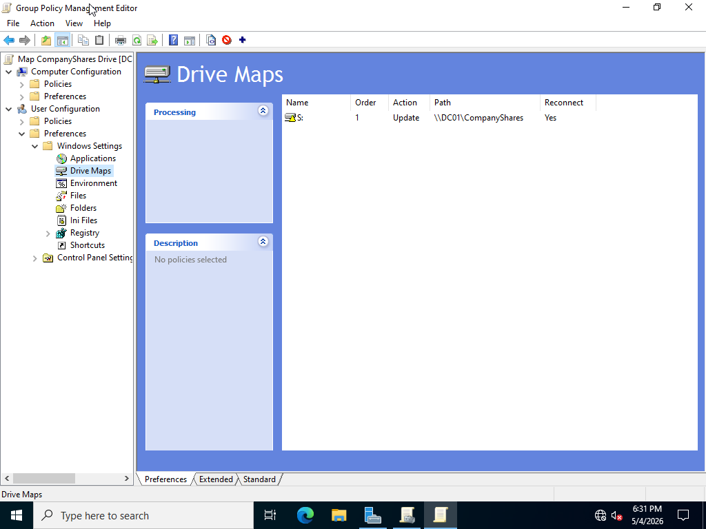
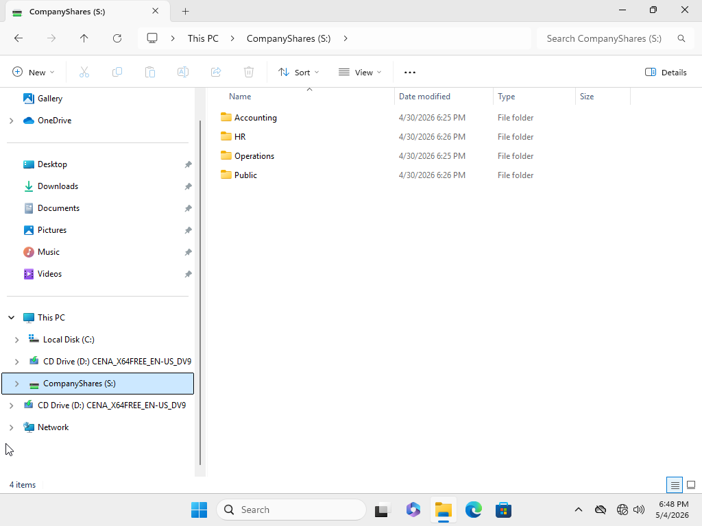
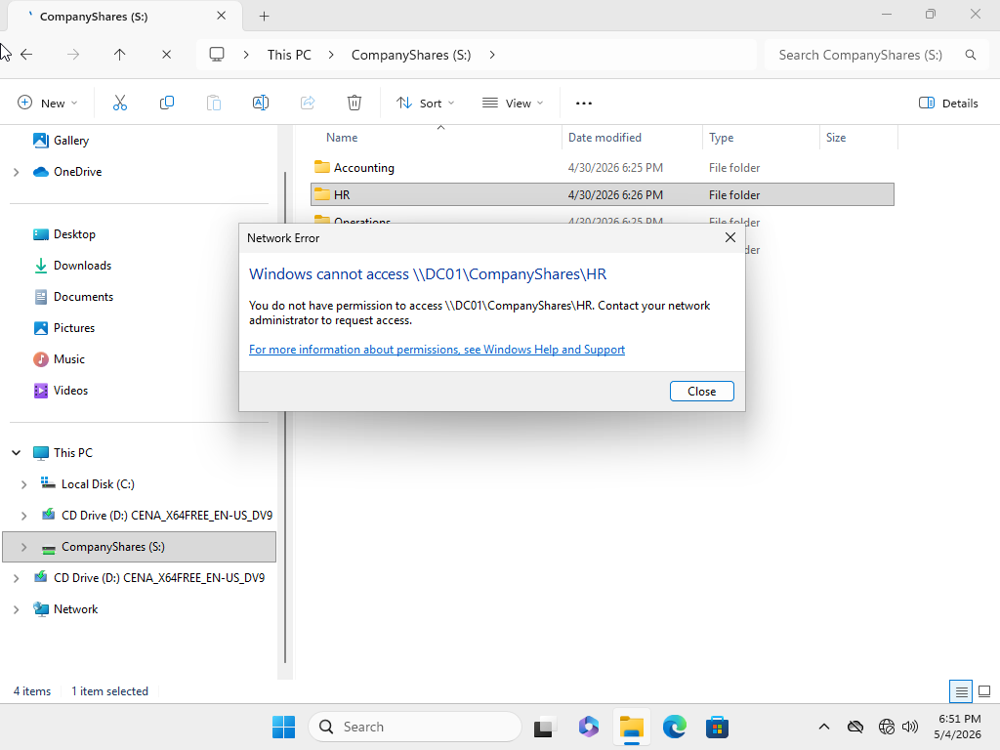
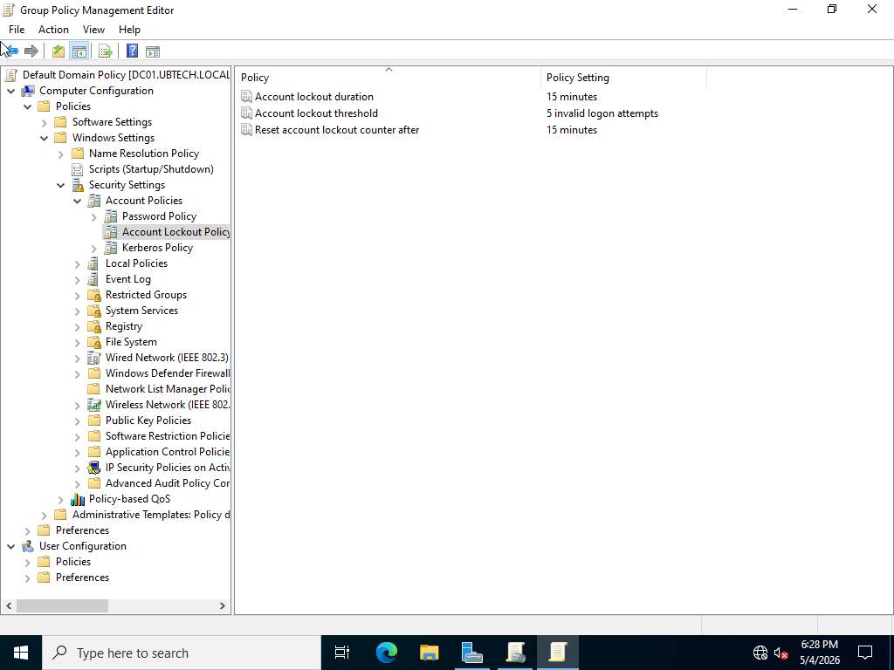

# Active Directory Home Lab

## Project Overview

This project simulates a small business Windows domain environment using Windows Server 2022 and Windows 11 Enterprise in VirtualBox. The goal was to build a realistic junior systems administrator lab that demonstrates Active Directory administration, domain-joined workstations, user and group management, shared folder permissions, Group Policy, and basic domain security controls.

## Project Screenshots

### DC01 Server Manager

This screenshot shows the Windows Server 2022 system used as the domain controller for the lab.



---

### Active Directory Organizational Units

This screenshot shows the Active Directory structure created for the lab, including department OUs such as IT, Accounting, Operations, and HR, along with a Workstations OU for computer objects.



---

### Active Directory Users and Groups

This screenshot shows department users and security groups configured in Active Directory.



---

### CLIENT01 Joined to the Domain

This screenshot shows the Windows 11 Enterprise client successfully joined to the `ubtech.local` domain.



---

### CompanyShares Folder Structure

This screenshot shows the department folder structure created on DC01.



---

### NTFS Permissions

This screenshot shows NTFS permissions configured for the Accounting folder using Active Directory security groups.



---

### Group Policy Drive Mapping

This screenshot shows the Group Policy configuration used to map the company file share as the `S:` drive.



---

### Mapped CompanyShares Drive

This screenshot shows the `CompanyShares (S:)` mapped drive appearing on CLIENT01 after Group Policy was applied.



---

### Permission Denied Test

This screenshot shows a domain user being blocked from accessing a department folder they are not authorized to use.



---

### Account Lockout Policy

This screenshot shows the domain account lockout policy configured in Group Policy.



## Lab Environment

| System | Role | Operating System |
|---|---|---|
| DC01 | Domain Controller, DNS, File Share, Group Policy | Windows Server 2022 Evaluation |
| CLIENT01 | Domain-joined workstation | Windows 11 Enterprise Evaluation |

## Domain Information

| Item | Value |
|---|---|
| Domain | ubtech.local |
| Domain Controller | DC01 |
| Client Workstation | CLIENT01 |
| Lab Network | 192.168.56.0/24 |
| DC01 LAB IP | 192.168.56.10 |
| CLIENT01 LAB IP | 192.168.56.20 |

## Objectives

- Install and configure Windows Server 2022 as a domain controller.
- Create an Active Directory domain named `ubtech.local`.
- Create organizational units for company departments.
- Create domain users and security groups.
- Join a Windows 11 Enterprise client to the domain.
- Configure shared folders for departments.
- Apply NTFS permissions using security groups.
- Configure a Group Policy mapped drive.
- Configure a domain account lockout policy.
- Test user access to verify permissions.

## Active Directory Structure

Organizational Units created:

- IT
- Accounting
- Operations
- HR
- Workstations

Security groups created:

- IT_Admins
- Accounting_Users
- Operations_Users
- HR_Users

Example users created:

| User | Username | Department |
|---|---|---|
| Tom Admin | tadmin | IT |
| Amy Smith | asmith | Accounting |
| John Roberts | jroberts | Operations |
| Mike Jones | mjones | Operations |
| Hannah Lee | hlee | HR |

## Shared Folder Structure

A shared folder was created on DC01:

```text
C:\CompanyShares
```

Department folders:

```text
C:\CompanyShares\Accounting
C:\CompanyShares\Operations
C:\CompanyShares\HR
C:\CompanyShares\Public
```

Network path:

```text
\\DC01\CompanyShares
```

## NTFS Permissions

Permissions were assigned using Active Directory security groups instead of individual users.

| Folder | Group | Permission |
|---|---|---|
| Accounting | Accounting_Users | Modify |
| Operations | Operations_Users | Modify |
| HR | HR_Users | Modify |
| Public | Domain Users | Modify |
| All folders | IT_Admins | Full Control |

Broad inherited permissions were removed from department folders to prevent unauthorized access.

## Group Policy Configuration

A Group Policy Object was created to automatically map the company share to domain users.

| Setting | Value |
|---|---|
| GPO Name | Map CompanyShares Drive |
| Drive Letter | S: |
| Network Path | \\DC01\CompanyShares |
| Label | CompanyShares |

After applying Group Policy, users logging into CLIENT01 automatically received the mapped `S:` drive.

## Account Lockout Policy

The Default Domain Policy was configured with the following account lockout settings:

| Setting | Value |
|---|---|
| Account lockout threshold | 5 invalid logon attempts |
| Account lockout duration | 15 minutes |
| Reset account lockout counter after | 15 minutes |

This provides a basic domain security control against repeated failed login attempts.

## Testing Performed

Testing was completed by logging into CLIENT01 as different domain users and verifying access to the mapped drive.

Example test results:

| User | Expected Access | Result |
|---|---|---|
| asmith | Accounting and Public | Successful |
| jroberts | Operations and Public | Successful |
| mjones | Operations and Public | Successful |
| hlee | HR and Public | Successful |
| tadmin | All folders | Successful |

Unauthorized folder access was blocked. For example, Amy Smith could access Accounting and Public but could not access Operations or HR.

## Skills Demonstrated

- Windows Server administration
- Active Directory Domain Services
- DNS basics
- Domain controller setup
- Domain-joined workstation configuration
- Organizational Units
- User and group management
- NTFS permissions
- Shared folder administration
- Group Policy Objects
- Mapped network drives
- Account lockout policy configuration
- Access control testing
- Basic troubleshooting

## Troubleshooting Notes

During the lab, several issues were identified and resolved:

- Corrected the DC01 LAB adapter IP address from `198.168.56.10` to `192.168.56.10`.
- Fixed DNS resolution issues by ensuring CLIENT01 used DC01 as its DNS server.
- Temporarily disabled the NAT adapter on CLIENT01 to force domain DNS resolution.
- Removed inherited permissions from department folders to prevent unauthorized access.
- Added users to the correct Active Directory security groups to allow proper folder access.

## Project Outcome

This lab successfully created a small business Active Directory environment with centralized user management, domain authentication, department-based file access, Group Policy drive mapping, and account lockout security controls. The project demonstrates practical junior systems administrator skills that apply to real Windows business environments.

## Resume Bullet

Built a Windows Server 2022 Active Directory home lab with a domain controller, domain-joined Windows 11 client, department OUs, users, security groups, shared folders, NTFS permissions, Group Policy mapped drives, and account lockout policies to simulate a small business IT environment.
